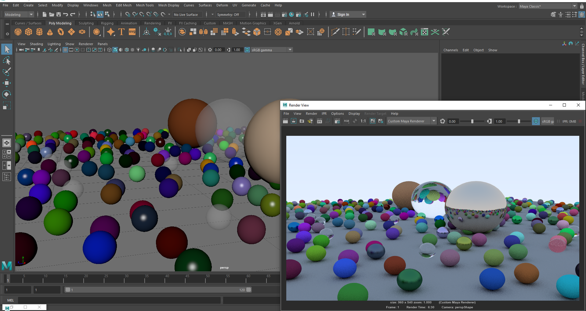

# Custom maya renderer



This project is a simple plugin to render Autodesk Maya scene in the render view. It is based on the book RaytracingInOneWeekend modified to work with meshes.
This plugin includes 3 materials:
 - Custom lambert
 - Custom metal
 - Custom dielectric
 
You can also find in the folder melScript a little script that will generate the scene shown in the above picture.
 
## How to compile the project
 
CustomMayaRenderer uses the following libraries:
 - glm: it is a math library use for vector computation. If it is not install with vcpkg, you will have to add the path to the include directory in the project settings.
 - MayaDevKit: it is the kit containing everything usefull for maya plugins. The project has been tested with the 2018 version.

To make the project compile, you have to create this two environment variables:
 - ```MAYA_DEV_KIT_PATH```: path to the MayaDevKit
 - ```MAYA_PYTHON_PATH```: path to the python module of maya. Usually in MAYA_PATH/Python/Lib/site-packages

 Once done, the plugin should compile and a folder ```sandbox``` have been created at the root of the project. Specify the location of this folder in the ```MAYA_MODULE_PATH``` so Maya can find it and it will appear inside of Maya plugins list.